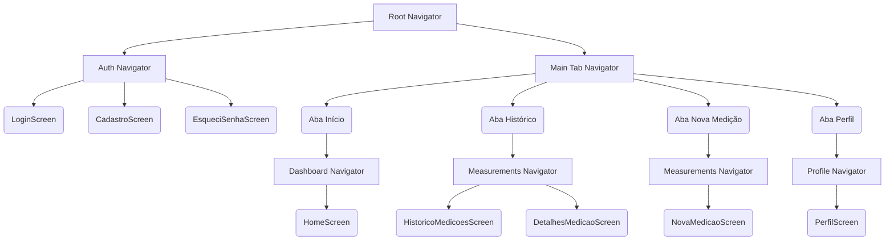

# Pressão Fácil

**Pressão Fácil** é um aplicativo mobile de monitoramento de pressão arterial, desenvolvido para tornar o acompanhamento da saúde cardiovascular simples, acessível e tranquilizador — especialmente para pessoas idosas ou com pouca familiaridade com tecnologia.

## Sobre o projeto

O app permite que o usuário registre suas medições de pressão arterial e frequência cardíaca de forma rápida, visualize seu histórico completo, acompanhe a evolução ao longo do tempo por meio de gráficos, e compartilhe relatórios em PDF com médicos ou familiares. Também conta com um sistema de lembretes configuráveis para ajudar o usuário a manter a regularidade nas medições, e um passo a passo instrucional que orienta a forma correta de medir a pressão, reduzindo erros de leitura.

## Principais funcionalidades

- 📊 **Registro de medições**: entrada rápida de pressão sistólica/diastólica, frequência cardíaca, data, hora e contexto (antes do café, após atividade física, após medicamento).
- 📈 **Histórico e evolução**: lista filtrável de medições anteriores e gráficos de tendência (7 dias, 30 dias, 6 meses, ano).
- 🔔 **Alertas e lembretes**: notificações configuráveis para não perder o horário das medições diárias.
- 👤 **Perfil de saúde**: dados pessoais, tipo sanguíneo, peso, altura e contato de emergência, sempre visíveis para situações de urgência.
- 📄 **Relatórios**: geração e compartilhamento de relatórios em PDF para consultas médicas.
- 🩺 **Guia de medição**: instruções passo a passo para garantir medições precisas.

## Público-alvo

O design prioriza legibilidade, alto contraste, tipografia acessível e elementos de toque generosos, voltados especialmente para o público idoso e pessoas com hipertensão que precisam de acompanhamento contínuo da própria saúde.

## Stack técnica

Aplicativo React Native construído sobre a arquitetura **Feature-Sliced Design**, com separação clara entre módulos de negócio independentes (`features/`), infraestrutura compartilhada (`shared/`) e orquestração de navegação (`navigation/`). Veja `docs/architecture.md` para detalhes da arquitetura.
 
 # Estrutura do Projeto: (Offline-First)

Este documento detalha a árvore de arquivos e diretórios da aplicação `pressao-facil`. Como a aplicação opera de forma totalmente local (**offline-first** utilizando AsyncStorage), a estrutura baseada no *Feature-Sliced Design* foi otimizada para remover camadas desnecessárias de comunicação com backend (APIs, DTOs e Mappers).

---

## Árvore Completa (`src/app/`)

Abaixo está o detalhamento de todos os arquivos e submódulos, organizados por domínio de negócio.

```text
src/app/
├── features/                  # (1) Módulos de negócio independentes
│   │
│   ├── alerts/                # Lógica de lembretes e notificações
│   │   ├── hooks/index.ts
│   │   ├── navigation/AlertsNavigator.tsx
│   │   ├── screens/AlertasScreen.tsx
│   │   ├── services/index.ts
│   │   ├── store/alertasStore.ts
│   │   ├── types/index.ts
│   │   └── index.ts           # Barrel public export
│   │
│   ├── auth/                  # Lógica de acesso (mesmo offline, ex: biometria/PIN)
│   │   ├── hooks/index.ts
│   │   ├── navigation/AuthNavigator.tsx
│   │   ├── screens/CadastroScreen.tsx
│   │   ├── screens/EsqueciSenhaScreen.tsx
│   │   ├── screens/LoginScreen.tsx
│   │   ├── services/index.ts
│   │   ├── store/authStore.ts
│   │   ├── types/index.ts
│   │   └── index.ts
│   │
│   ├── dashboard/             # Resumo principal da aplicação
│   │   ├── hooks/useDashboardSummary.ts
│   │   ├── navigation/DashboardNavigator.tsx
│   │   ├── screens/HomeScreen.tsx
│   │   ├── services/index.ts
│   │   ├── store/index.ts
│   │   ├── types/index.ts
│   │   └── index.ts
│   │
│   ├── evolution/             # Feature "Lite" (Gráficos e evolução)
│   │   ├── screens/EvolucaoScreen.tsx
│   │   ├── types/index.ts
│   │   └── index.ts
│   │
│   ├── measurements/          # Domínio principal (registro de pressão arterial)
│   │   ├── hooks/index.ts
│   │   ├── navigation/MeasurementsNavigator.tsx
│   │   ├── screens/DetalhesMedicaoScreen.tsx
│   │   ├── screens/HistoricoMedicoesScreen.tsx
│   │   ├── screens/NovaMedicaoScreen.tsx
│   │   ├── services/index.ts
│   │   ├── store/medicoesStore.ts
│   │   ├── types/index.ts
│   │   └── index.ts
│   │
│   ├── onboarding/            # Feature "Lite" (Primeiros passos do usuário)
│   │   ├── screens/InstrucoesMedicaoScreen.tsx
│   │   ├── screens/SplashScreen.tsx
│   │   └── index.ts
│   │
│   ├── profile/               # Dados do usuário e contatos de emergência
│   │   ├── hooks/index.ts
│   │   ├── navigation/ProfileNavigator.tsx
│   │   ├── screens/PerfilScreen.tsx
│   │   ├── services/index.ts
│   │   ├── store/index.ts
│   │   ├── types/index.ts
│   │   └── index.ts
│   │
│   └── reports/               # Feature "Lite" (Exportação de dados)
│       ├── screens/RelatoriosScreen.tsx
│       └── index.ts
│
├── navigation/                # (2) Orquestração de Rotas Globais
│   ├── MainTabNavigator.tsx   # Configuração das abas inferiores (Bottom Tabs)
│   └── RootNavigator.tsx      # Navegador raiz (Alterna entre Auth e MainTab)
│
└── shared/                    # (3) Componentes e Lógicas Globais
    ├── components/            # UI "Dumb" (Sem regras de negócio)
    │   ├── BottomNavBar.tsx
    │   ├── Button.tsx
    │   └── TopAppBar.tsx
    ├── store/sessionStore.ts  # Estado global (Usuário ativo na sessão, Temas)
    └── types/navigation.ts    # Tipagens globais de rotas
```

---

## Entendendo os Submódulos (Anatomia Padrão)

Cada pasta dentro de `features/` segue um conjunto padronizado de submódulos projetado para a arquitetura Offline-First.

*   **`types/`**: Contém o **Modelo de Domínio Limpo**. Aqui se define as interfaces Typescript (ex: `Medicao`, `PerfilUsuario`). Como não há DTOs e Mappers, é exatamente este tipo que será processado e salvo no LocalStorage.
*   **`store/`**: Onde os dados ganham persistência e reatividade. Usando *Zustand* combinado ao *AsyncStorage*, a store mantém o estado local em memória e sincroniza a gravação para o disco do celular automaticamente.
*   **`hooks/`**: Integra as regras da Store com a UI. Serve para facilitar abstrações (ex: `useDashboardSummary` pode ler dados da `medicoesStore` para calcular a média e devolver para a tela sem bloquear a renderização principal).
*   **`services/`**: Lógicas de negócio mais pesadas que não têm relação com o React e não dependem do ciclo de vida de um componente (ex: cálculos estatísticos do histórico ou agendamento local de notificações).
*   **`screens/` e `navigation/`**: Camada estrita de visualização. As telas (`Screens`) não gerenciam persistência nem tomam decisões de negócio, apenas injetam os Hooks/Stores e renderizam a UI. O `Navigator` interno orquestra os passos de telas que pertencem apenas àquela feature.
*   **`index.ts`**: (Obrigatório) **A porta de entrada pública da feature**. Todo elemento que outra feature ou a infraestrutura global precisar acessar (como a `MeasurementsNavigator` sendo puxada pelo `MainTabNavigator`) precisa ser exportado explicitamente aqui. Importações passando pelo `index.ts` evitam o acoplamento excessivo.

---
# Arquitetura de Navegação

A navegação do **Pressão Fácil** foi desenhada para seguir o modelo do *React Navigation v7*, totalmente adaptada ao paradigma *Feature-Sliced Design*. Isso significa que as rotas globais não conhecem as telas diretamente, elas apenas orquestram os "Navigators" expostos por cada feature.

---

## 1. Visão Geral da Topologia (Árvore de Navegação)

A estrutura de navegação do aplicativo é dividida em três níveis de profundidade: **Root**, **Tabs** e **Stacks das Features**.



---

## 2. Nível 1: `RootNavigator` (Orquestrador Global)
Localizado em `src/app/navigation/RootNavigator.tsx`.

O `RootNavigator` atua como um semáforo (Switch). Ele observa a *Store de Sessão* para decidir qual fluxo o usuário deve ver. Ele impede que um usuário deslogado acesse a aplicação, e que um usuário logado volte para a tela de login pelo botão "voltar" nativo.

*   **Se `user == null`**: Monta o `AuthNavigator` (Fluxo Público).
*   **Se `user != null`**: Monta o `MainTabNavigator` (Fluxo Autenticado).

---

## 3. Nível 2: `MainTabNavigator` (Orquestrador de Abas)
Localizado em `src/app/navigation/MainTabNavigator.tsx`.

É o roteador inferior do aplicativo (Bottom Tabs). Ele compõe a navegação primária inserindo os *Navigators* das features dentro das abas.

1.  **Aba "Início"**: Renderiza o `DashboardNavigator` (vindo da feature `dashboard`).
2.  **Aba "Histórico"**: Renderiza o `MeasurementsNavigator` configurado para abrir a rota `HistoricoMedicoesScreen`.
3.  **Aba "Nova Medição"**: Renderiza o `MeasurementsNavigator` configurado para abrir diretamente a rota `NovaMedicaoScreen` (ou pode chamar um Modal global vindo da Tab).
4.  **Aba "Perfil"**: Renderiza o `ProfileNavigator` (vindo da feature `profile`).

---

## 4. Nível 3: Navigators das Features
Cada feature complexa (que possui mais de uma tela ou precisa encapsular cabeçalhos) gerencia sua própria pilha (Stack) de telas. Isso garante que a feature `auth`, por exemplo, decida sozinha como fluir da tela de Login para a de Cadastro.

### 🔐 Feature: Auth (`AuthNavigator`)
Responsável pelo onboarding e acesso do usuário.
- `LoginScreen` (Rota inicial)
- `CadastroScreen` (Acessado a partir do Login)
- `EsqueciSenhaScreen` (Acessado a partir do Login)

### 📊 Feature: Measurements (`MeasurementsNavigator`)
Esta feature contém as telas cruciais da regra de negócio. O Navigator interno permite o livre trânsito entre as telas de pressão.
- `HistoricoMedicoesScreen` (Lista de dados guardados)
- `DetalhesMedicaoScreen` (Ao clicar em um item da lista)
- `NovaMedicaoScreen` (O formulário de cadastro de pressão)

### 🏠 Features de Tela Única (Dashboard, Profile, Alerts)
Ainda que tenham apenas uma tela (`HomeScreen`, `PerfilScreen`), elas são envelopadas em um *Navigator* próprio (ex: `DashboardNavigator`). 
**Por que?** Porque caso no futuro o *Dashboard* precise ter uma "Sub-tela de Notificações", o time adiciona essa rota dentro do `DashboardNavigator` e nada quebra no orquestrador global (Abas).

---

## 5. Como uma Feature navega para outra?

De acordo com o *Feature-Sliced Design*, as telas de uma feature não importam telas de outra. 

Se a `HomeScreen` (dashboard) precisa colocar um atalho para a tela de `Alertas`, como ela faz?
A navegação global é gerenciada por rotas nomeadas estritas em `shared/types/navigation.ts`.

A `HomeScreen` irá utilizar o `useNavigation` puxando o contrato global:
```typescript
navigation.navigate('AlertsStack', { screen: 'Alertas' });
```
Dessa forma, a tela que solicitou a mudança de rota apenas envia uma "mensagem/intenção" para o Orquestrador Global de que deseja ir para um destino, sem precisar de acoplamento rígido de importação de telas de fora do seu domínio.

## Como Executar o Projeto

O projeto utiliza o **Expo** para gerenciar o ambiente de desenvolvimento React Native. Para executá-lo:

### Pré-requisitos
Certifique-se de ter instalado na sua máquina:
- Node.js (versão 18 ou superior)
- Um gerenciador de pacotes (`npm`, `yarn` ou `pnpm`)

### Instalação e Execução Padrão

1. No seu terminal, acesse a raiz do projeto (onde está o arquivo `package.json`).
   ```bash
   cd pressao-facil
   ```

2. Instale as dependências.
   ```bash
   npm install
   ```

3. Inicie o servidor do Expo.
   ```bash
   npm start
   # ou 'npx expo start'
   ```

### Visualizando no Dispositivo

Ao rodar `npm start`, um QR Code aparecerá no terminal.

*   **Dispositivo Físico (Recomendado):** Baixe o app **"Expo Go"** (da App Store ou Google Play Store). Abra o app e escaneie o QR Code exibido no terminal.
    *   *Nota: Se aparecer a mensagem "Project is incompatible with this version of Expo Go", atualize o aplicativo Expo Go na loja do seu celular.*
*   **Emulador Android (Android Studio):** Com o emulador Android aberto, pressione a tecla **`a`** no terminal do Expo.
    *   *Dica: Caso o emulador informe incompatibilidade de versão, feche o emulador, aperte `Shift + U` no terminal para atualizar o Expo Go no dispositivo virtual, e depois `a` novamente.*
*   **Simulador iOS (apenas Mac):** Com o Xcode instalado, pressione a tecla **`i`** no terminal.
*   **Versão Web (Preview local):** Pressione a tecla **`w`** no terminal para testar o aplicativo diretamente no navegador de internet.
